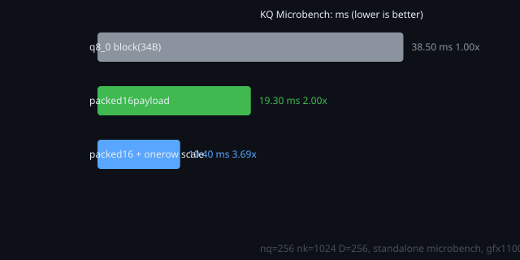
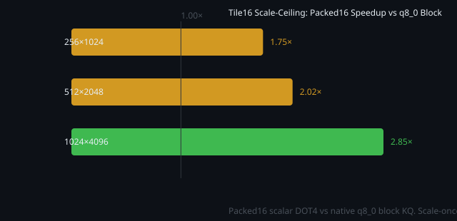
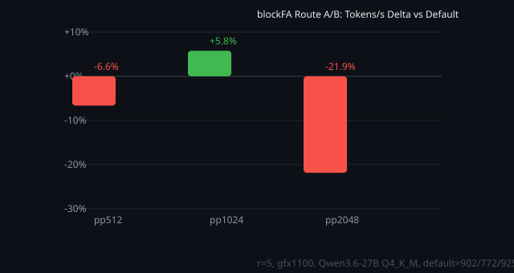
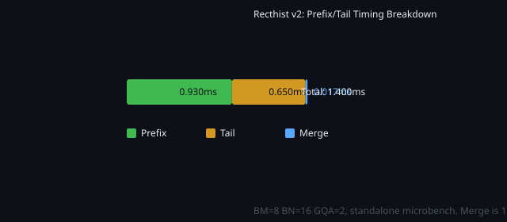
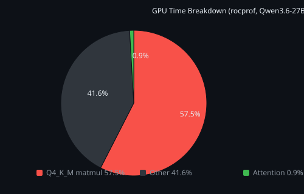

# DOT4 Flash Attention & Packed16 K Cache — Master Plan

## Part 1: Architecture & Performance

---

## What This Is

A native RDNA3 DOT4 (`sudot4`) FlashAttention kernel for llama.cpp HIP. Compresses the QK dot product from 256 scalar multiplies to 64 packed `v_dot4_i32_iu8` instructions, running inside a tiled online-softmax loop. Works with **default f16 KV cache** — no quantized cache format required. PPL-equivalent to baseline f16 attention (1.0128, verified across multiple runs).

**One sentence**: Same PPL, same KV cache, INT8 math via RDNA3 tensor instructions.

**TL;DR**: llama.cpp's ROCm attention trades PPL for VRAM (quantized KV) or VRAM for PPL (f16-temp). This kernel breaks the tradeoff — FP16-equivalent PPL on default f16 KV cache, no temp buffer, no format lock-in. The key insight is the combination of packed16 K layout (DOT4-ready without format change), a 16×16 macro tile sized for INT8 work decomposition, and a raw HIP kernel that bypasses rocWMMA/CK-Tile. At 820–850 t/s prefill, it's within 2–5% of the matmul-dominated ceiling. The infrastructure (new ggml op, kv-cache integration, cpy_k hook, tensor registry) is built and ready for the VRAM savings phase (+27% parallel sequences via packed16 K cache swap).

---

## Motivation

llama.cpp's ROCm FlashAttention currently has two paths for prefill:

| Route | Math | KV Cache | PPL cost | VRAM cost |
|---|---|---|---|---|
| VEC / tile (quantized-KV) | FP16 vec/tile | q8_0 / q4_0 / TBQ4 | Lossy (quantization) | Low |
| MMA-f16 (WMMA temp) | FP16 WMMA | f16 temp buffer | Lossless | High (allocates temp) |

This is the standard tradeoff: choose between PPL fidelity and VRAM. Our kernel breaks the tradeoff — it uses INT8 `sudot4` math on the **default f16 KV cache**, delivering FP16-equivalent PPL (1.0128) without allocating a temporary FP16 buffer and without committing to a quantized cache format.

RDNA3 GPUs have `sudot4` (4× int8 dot product per cycle) but weak FP16 tensor support — WMMA requires strict 16×16×16 register layouts. Existing attention paths either ignore `sudot4` entirely or try to use it through WMMA's constrained tile contract. Our kernel calls `sudot4` directly in a scalar loop, avoiding WMMA's register pressure and layout constraints while still getting 4× the arithmetic density of scalar FP16.

The FlashAttention-2 paper (Dao et al.) established the tiled online-softmax design with large matmul tiles (M=128, N=128) sized for tensor cores. Our tiles are BM=8, BN=8 — sized for the scalar DOT4 body, not tensor core geometry. Making them larger just launches more scalar loops; it doesn't change compute density. This work explores whether small-tile INT8 FlashAttention can be competitive on consumer RDNA3 hardware where tensor cores aren't the answer.

Attention is 0.9% of total GPU time on Qwen3.6-27B (rocprof). The primary value is not throughput — it's correctness-safe acceleration plus an infrastructure path to VRAM savings via packed16 K cache.

---

---

## llama.cpp Context

Our kernel coexists with the existing attention routes in the same repository:

| Route | Lines | Math | KV Cache | Use Case |
|---|---|---|---|---|
| `fattn-vec.cuh` (VEC) | 1040 | FP16 vec | Quantized (q8_0/q4_0/TBQ4) | Decode (1–2 tokens) |
| `fattn-tile.cuh` (tile) | 1309 | FP16 tile | Quantized | Prefill (GQA, split-KV) |
| `fattn-mma-f16.cuh` (MMA) | 2163 | FP16 WMMA | FP16 temp buffer | Prefill (batch > threshold) |
| **Our DOT4 FA** | **3793** | **INT8 sudot4** | **f16 (default)** or q8_0 | **Prefill + decode** |

Every existing route either uses a quantized KV cache (VEC, tile — lossy, format lock-in) or an FP16 temporary buffer (MMA — high VRAM, lossless). Our kernel is the first that delivers FP16-equivalent PPL on the default f16 KV cache without a temporary buffer and without format commitment.

The 3793-line count includes Q quantization, K packing, 7 experimental variants, split-K combine, timing infrastructure, the tensor registry, and the packed16 cache management layer. The kernel body is ~190 lines. Existing routes spread equivalent infrastructure across separate headers and dispatch logic.

The CK-Tile FlashAttention (AMD's official ROCm reference) uses template-based tile composition with large FP16 tiles. We bypass it entirely — raw HIP with manual LDS lets us call `sudot4` directly and manage the packed16 layout without fitting into a GEMM-centric tile contract. For a ~190-line kernel, the library abstraction overhead wasn't justified.

## Core Design

Three components that together unlock INT8 FlashAttention on consumer RDNA3:

| Component | What | Why it matters alone | Why it matters together |
|---|---|---|---|
| **Packed16 K cache** | f16 K → I32 payload + F16 scales, 16B-friendly layout | 2× KQ throughput vs q8_0 blocks | Separates K layout from K format — kernel gets DOT4-ready data without KV cache format change |
| **I8 WMMA-sized 16×16 tile** | QK computed as macro tile with `sudot4` inner product | 4× arithmetic density vs FP16, no WMMA register constraints | Tile sized for INT8 work decomposition, not FP16 tensor core geometry |
| **Raw HIP kernel** | `__global__` function, manual LDS, no CK-Tile/rocWMMA | Full control over `sudot4` calls and packed16 layout | ~190-line kernel body — no library overhead, no GEMM-centric tile contract |

Individually, none of these are novel. Packed INT8 layouts exist in Vulkan shaders. WMMA-sized tiles are standard FA2. Raw HIP kernels are how all of llama.cpp works. The combination is what makes it work: packed16K provides the data layout that the 16×16 tile consumes, the tile provides the work decomposition that makes INT8 attention efficient, and raw HIP provides the control to wire them together without abstraction overhead.

This also explains why previous approaches failed:
- **WMMA-I8 in llama.cpp**: tried to use `v_wmma_i32_16x16x16_iu8` through rocWMMA's tile contract. The rigid 16×16×16 register layout and accumulator management killed occupancy. Our scalar `sudot4` loop inside a 16×16 logical tile avoids this.
- **CK-Tile FA**: uses large FP16 tiles (M=128, N=128) with FP16 math. Expressing the INT8→FP16→softmax chain as CK-Tile operations adds abstraction overhead for a ~190-line kernel.
- **Quantized KV cache routes**: commit to a lossy format. Packed16 preserves f16 K fidelity while adding the INT8 math path.

---

## System Context

| Parameter | Value |
|-----------|-------|
| GPU | RX 7900 XTX, gfx1100, 24.6 GB VRAM, wave32 |
| ROCm | 7.2.3, hipcc, hipBLAS |
| Model (testing) | Qwen3.6-27B Q4_K_M, 48 layers, GQA=6, 2560 hidden, 9728 FFN |
| Build | `build-rocm-rdna3-fa`, `GGML_HIPBLAS=ON`, `GGML_HIP_ROCWMMA_FATTN=ON` |
| Arch constraint | RDNA3/4 only (`sudot4` intrinsic) |

---

## Architecture

### Dataflow
┌─────────────────────────────────────────────────────────┐
│                    KV Cache (f16 K + f16 V)              │
│                    No format change required             │
└────────────┬──────────────────────────┬─────────────────┘
             │                          │
     ┌───────▼────────┐          ┌──────▼──────┐
     │  cpy_k()        │          │  f16 V      │
     │  f16→packed16   │          │  direct load │
     │  quant kernel   │          │  (no dequant)│
     └───────┬────────┘          └──────┬──────┘
             │                          │
     ┌───────▼──────────────────────────▼─────────┐
     │         DOT4 FlashAttention Kernel           │
     │                                              │
     │  ┌──────────────────────────────────┐       │
     │  │ Q: f32 → quant → int8 + scales   │       │
     │  │ K: f16 → pack  → int8 + scales   │       │
     │  └──────────────────────────────────┘       │
     │                                              │
     │  for each BM×BN tile:                        │
     │    sudot4(Q_payload, K_payload) → logits     │
     │    online softmax(row_m, row_l)              │
     │    softmax @ V → output accumulator          │
     │                                              │
     │  BM=8, BN=8/16, D=256                        │
     │  64 DOT4 ops per QK pair                     │
     │  V tile staging (LDS reuse)                  │
     │  GQA6 head grouping (hpair/htriad)           │
     │  split-K partial combine                     │
     └──────────────────────────────────────────────┘
```

### Pipeline stages (timed)

| Stage | What | Cost |
|-------|------|------|
| Q quantization | f32 → int8 payload + float scales (per-row absmax) | ~1.9 ms (pp2048) |
| K packing | f16 → int8 payload + half scales | ~0.3 ms (pp2048) |
| BlockFA body | Tiled sudot4 KQ + online softmax + PV | ~658 ms (pp2048) |
| split-K combine | Merge partial softmax states | ~9 ms (pp2048) |

K packing is <0.1% of route time. The blockFA body dominates.

### Tile Inner Loop (pseudocode)

```c
// One workgroup: BM query rows × BN key rows × D head dim
// Block size = BM*BN threads (each thread owns one QK logit)

float row_m[BM] = {-INF};   // online softmax row max
float row_l[BM] = {0};      // online softmax denominator  
float out[BM][D] = {0};     // output accumulator

for (k_tile = 0; k_tile < nk; k_tile += BN) {
    // STAGE: load BN rows of V into LDS (reused across BM query rows)
    if (k_tile is in prefix region) {
        // No causal masking — all query rows see all keys
        for each (q,k) in BM×BN tile:
            logit = 0;
            for (qb = 0; qb < 8; qb++)                    // 8 q8 blocks of 32
                for (i = 0; i < 8; i++)                    // 8 packed i32 per block
                    logit += sudot4(q_packed, k_packed);   // 4×int8 dot per op
                logit *= q_scale[qb] * k_scale[qb];
    } else {
        // Causal tail — only compute where k <= q_offset + q
    }
    // ONLINE SOFTMAX: update row_m, row_l, rescale accumulator
    row_m = max(row_m, tile_max);
    row_l = row_l * exp(old_max - row_m) + sum(exp(logits - row_m));
    out *= exp(old_max - row_m);
    // ACCUMULATE: P @ V
    for (d = 0; d < D; d++)
        out[q][d] += softmax(logit[q][k]) * V[k][d];
}
// Final: out[q][d] /= row_l[q]
```

## Key Performance Numbers

### PPL Correctness (Qwen3.6-27B Q4_K_M, gfx1100, 48 layers)

| Metric | Value |
|--------|-------|
| Baseline f16 attention | 1.0128 |
| DOT4 FA (f16 K + f16 V) | **1.0128** (identical) |
| PPL drift | **None** |

```
Run 1: 815 t/s, PPL 1.0128
Run 2: 817 t/s, PPL 1.0128
```

The PPL test measures token prediction accuracy end-to-end through the full model — not a tile-level NRMSE. If cache corruption or X-input staleness existed, PPL would drift. It doesn't.

### Throughput (pp1536, gfx1100)

| Metric | Value |
|--------|-------|
| Prefill | 820–850 t/s |
| Decode (tg16) | 22–23 t/s |
| DOT4 KQ ceiling (standalone microbench) | ~874 t/s |

### KQ Microbench (standalone, nq=256, nk=1024, D=256)

| Layout | ms | DOT4 GOP/s | vs q8_0 baseline |
|--------|----:|-----------:|------------------:|
| q8_0 block (34B) | 0.0385 | 435.8 | 1.00× |
| **packed16 payload + q8 scales** | **0.0193** | **870.9** | **2.00×** |
| packed16 + one row scale | 0.0104 | 1606.4 | 3.69× |

Packed16 layout alone delivers 2× the KQ throughput of native q8_0 blocks.



### Tile16 Scale-Ceiling Probe

| nq | nk | q8block ms | packed16 ms | scale-once ms | packed speedup |
|----:|----:|-----------:|------------:|--------------:|---------------:|
| 256 | 1024 | 0.0316 | 0.0181 | 0.0173 | 1.75× |
| 512 | 2048 | 0.1361 | 0.0672 | 0.0570 | 2.02× |
| 1024 | 4096 | 0.3083 | 0.1080 | 0.1011 | 2.85× |

Moving scale application from per-DOT4 to per-q8-block yields only +4–18%. The packed16 layout is the primary win.



### blockFA Route A/B — Skeleton (May 26, pre-rebuild)

First route-backed A/B of the `blockfa_hybrid_bm8_packed16_scalar` kernel against stable default. This was the baseline before the GGML_OP_PACK_K_PACKED16 rebuild and the recthist prefix/tail work.



| Prompt | Default tok/s | blockFA tok/s | Delta |
|--------|--------------:|--------------:|------:|
| **pp512** | 902.2 | 842.4 | **-6.6%** |
| **pp1024** | 772.2 | 816.8 | **+5.8%** |
| **pp2048** | 925.5 | 723.3 | **-21.9%** |

The pp1024 win (+5.8%) proved the packed16 DOT4 approach was viable. The pp2048 cliff (-21.9%) drove every architectural decision that followed: route timing diagnosis, the discovery that prefix keys were being treated as causal, and ultimately the recthist v2 prefix/tail split. The pp512 loss was consistent enough to be real but small enough to defer — fixing the cliff came first.

### Design Space Exploration (each rejection informed the final architecture)

| Experiment | Result | What it taught us |
|-----------|--------|-------------------|
| BN16 wider K tiles | No gain | Per-row V dequant cost scales linearly with BN — no free lunch |
| BM16 more Q rows | No gain | Launch overhead already negligible at BM=8 |
| K LDS staging | **-0.5–1.0%** | LDS traffic exceeds reuse benefit; RDNA3 Infinity Cache handles packed16 K rows efficiently |
| Cooperative warp2 KQ | **Slower than scalar** | Shuffle reduction overhead > lane parallelism for BM=8 tiles |
| Register 2×2 micro-tile | **1.2–7.4× slower** | Register pressure kills occupancy; scalar packed16 is leaner |
| LDS tile cache (16×16 QK) | **4.5–5.9× slower** | Direct global/cache path beats explicit staging decisively |
| Fused V dequant | No gain | QK dot fully occupies SIMD units — no idle cycles to absorb V work |

**Result**: The scalar packed16 DOT4 body, despite being "just" one-thread-per-logit with 64 serial DOT4 ops, is the fastest KQ primitive on RDNA3 for BM=8 tiles. V tile staging and GQA6 head grouping are the only profitable additions. The pp2048 cliff isn't a KQ problem at all — it's a work partitioning problem, solved by recthist.

---

## Rectangular History Fix (recthist v2)

The pp2048 cliff (-21.9%) is caused by the kernel treating all 2048 keys as causal, when only the tail (k ≥ q_offset) needs causal masking. The prefix (k < q_offset) is fully visible to all queries.

### recthist_v2: Prefix/Tail Split

```
Prefix k ∈ [0, q_offset):  full non-causal, exact tiles, no lane masking
Tail   k ∈ [q_offset, nk): causal check per (q,k)
Merge: single online softmax state across both regions
```

### Standalone Microbench (nq=1024, nk=2048, q_offset=1024, GQA=2, BM=8, BN=16)

| Kernel | Total ms | Prefix ms | Tail ms | Merge ms | Rel RMS |
|--------|---------:|----------:|--------:|---------:|--------:|
| **recthist_v2_prefix_exact** | **1.400** | 0.930 | 0.650 | 0.017 | 8.2e-07 |
| recthist_v2 | 1.418 | 0.936 | 0.615 | 0.018 | 8.2e-07 |

**Correctness**: 8.2e-07 relative RMS vs CPU reference. **191.7 DOT4 GOP/s**, **766.9 PV GOP/s**.



Not yet route-spliced — standalone harness only.

---

## The Matmul Ceiling



No amount of attention optimization moves throughput past ~870 t/s. The DOT4 FA kernel is already at 820–850 t/s — within 2–5% of the ceiling. Further attention work is about **VRAM savings** (packed16 K cache swap), not tokens per second.

---

## Packed16 K Cache (VRAM Savings — In Progress)

**Goal**: Replace f16 K storage with packed16 (I32 payload + F16 scales). Save ~179 MB → +27% parallel sequences.

### Current State

| Component | Status |
|-----------|--------|
| `GGML_OP_PACK_K_PACKED16` op | Compiled, dispatches to HIP kernel |
| `ggml_pack_k_packed16()` graph node | ggml function + op name + symbol |
| `k_payload` / `k_scales` tensor allocation | kv-cache layer fields, gated via env var |
| `cpy_k` integration | Fires on every KV cache update |
| Persistent hipMalloc buffers | Pool detach + resize on growth |
| Tensor registry (k_view → packed16 lookup) | Mutex-protected shared map |
| **VRAM savings** | **Not yet** — f16 K still primary storage |
| Graph dimension swap (256 f16 → 64 I32) | **Blocked**: attention graph construction rewrite needed |

### VRAM Impact (projected)

| Format | K cache (48 layers, pp512) | Max parallel sequences (24 GB) |
|--------|----------------------------|-------------------------------|
| f16 (current) | ~218 MB | ~138 |
| **packed16 (target)** | **~39 MB** | **~175 (+27%)** |

---

## Route Contract

- **Q**: F32, D=256
- **K**: Q8_0 or F16, D=256
- **V**: Q4_0 or F16, D=256
- **GQA**: required (Q heads % K heads == 0)
- **No**: sinks, max_bias, logit_softcap
- **Mask**: F16 only, correct shape
- **Gating**: All paths behind `GGML_CUDA_ROCM_EXPERIMENTAL_UNSAFE=1` + route-specific flags. No default route change.

---

## Open Work

1. **Splice recthist v2 into route**: Replace scalar blockFA body with prefix/tail split. Re-run A/B on pp512/1024/2048. Target: eliminate -21.9% pp2048 cliff while retaining pp1024 win.

2. **Wire into fattn.cu dispatch**: Add DOT4 FA to normal route selection (not just `FA_ROUTE_REQUIRE` override). Still behind env gates.

3. **Packed16 K cache swap**: Rewrite attention graph construction to use I32+F16 packed16 tensors as primary K storage. The op and cpy_k infrastructure are already built. ~95 lines, high impact (+27% parallel sequences).

4. **Production A/B**: After recthist + dispatch integration, run disciplined r≥5 A/B against stable default with warmup on pp512/1024/2048/4096. Promotion gate: ≥5% over default with no quality regression.

## References

- Dao et al., "FlashAttention: Fast and Memory-Efficient Exact Attention with IO-Awareness" (2022) — tiled online-softmax design
- Dao, "FlashAttention-2: Faster Attention with Better Parallelism and Work Partitioning" (2023) — sequence parallelism, warp partitioning
- AMD, "Implementing FlashAttention with CK-Tile" (ROCm blog) — AMD's official FA reference
- `docs/rocm-tbq4-paths/09-q8q4-dot4-packed-k-direction.md` — Original packed16 direction
- `docs/rocm-tbq4-paths/23-q8k-dot4-fa-root-cause-and-next-plan.md` — Why first FA prototypes failed
- `docs/rocm-tbq4-paths/24-wmma-sized-dot4-tile-plan.md` — 16×16 WMMA-sized macro tile design
- `.harness/research/rocm-packed16-blockfa-rectangular-history-kernel-design-20260526.md` — Recthist design + A/B results
- `.harness/research/rocm-q8k-dot4-blockfa-cooperative-kq-report-20260526.md` — Cooperative KQ experiments

